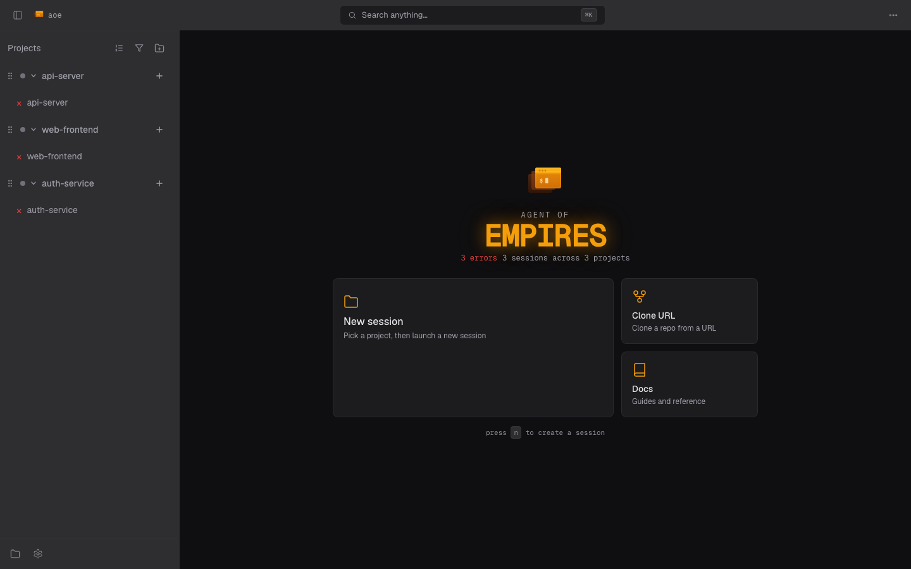

# Web Dashboard

Monitor and interact with agent sessions from any browser (phone, tablet, or another computer). The dashboard runs as an embedded server inside the `aoe` binary; start it with `aoe serve`. Sessions run server-side (a real `tmux` session for terminal sessions, a persistent worker for structured-view sessions), so your work survives browser crashes, network drops, and reconnects.



## In this section

This page covers running the server, access modes, the security model, and PWA install. The rest of the surface has its own pages:

- **[Dashboard & workspaces](web/dashboard.md)**: layout, status glyphs, session-creation wizard, sidebar sort/grouping, triage (pin / archive / snooze), command palette, first-run tutorial.
- **[Terminal view](web/terminal.md)**: agent and paired terminals, reconnect behavior, WebSocket close codes, read-only mode.
- **[Diff view](web/diff.md)**: reviewing changed files, flat / tree file list, per-session base override, inline review comments.
- **[Settings & profiles](web/settings.md)**: settings tabs, profile picker, connected-device tracking, step-up elevation.

Mobile and touch behavior is documented inline on each page.

## Availability

The dashboard ships in all release binaries: [GitHub Releases](https://github.com/agent-of-empires/agent-of-empires/releases), the [quick install script](../installation.md#quick-install-recommended), and Homebrew (`brew install aoe`). Just run `aoe serve`.

Building from source requires the `serve` Cargo feature (and Node.js to compile the embedded frontend); see [Web Dashboard Development](../development/web-dashboard.md).

## Starting the server

```bash
aoe serve                       # Localhost only (safe, default)
aoe serve --remote              # Remote over HTTPS (Tailscale Funnel, else Cloudflare quick tunnel)
aoe serve --host 0.0.0.0        # LAN/VPN access (HTTP, requires VPN)
aoe serve --daemon              # Run in background
aoe serve --open                # Open the URL in the default browser when ready
aoe serve --remote --read-only  # Monitor without terminal input
```

The server prints a URL with an auth token:

```
aoe web dashboard running at:
  http://localhost:8080/?token=a1b2c3...
```

Open it in any browser. The token is set as a cookie on first visit, so you don't need to keep it in the URL.

`--open` is suppressed with `--daemon` or `--remote`, over SSH (`SSH_CONNECTION` / `SSH_TTY` set), and on Linux/BSD with no `DISPLAY` / `WAYLAND_DISPLAY`.

### Retrieving the live URL

In `--remote` mode the auth token rotates every 4 hours, so a URL captured at startup eventually stops working. Use `aoe url` against a running daemon (exits non-zero if none is running):

```bash
aoe url               # Primary URL with the live token
aoe url --all         # Every labeled URL (Tailscale / LAN / localhost), tab-separated
aoe url --token-only  # Just the token (for scripted login)
```

`--remote` mode also prints a QR code for phone pairing.

## Remote access

`--remote` is the recommended way to reach the dashboard from your phone. aoe picks a transport automatically, in this order. For the end-to-end phone setup, see [Remote Access from Your Phone](remote-phone-access.md).

### 1. Tailscale Funnel (preferred when available)

If `tailscale` is on PATH and logged in, aoe runs `tailscale funnel --bg --yes <port>` and exposes the dashboard at your stable `https://<machine>.<tailnet>.ts.net` URL. No domain, no Cloudflare account, no rotating URLs. **This is the only option where a PWA installed on your phone keeps working across server restarts** (the URL is stable).

One-time setup (aoe surfaces the fix if a gate is missing):
1. Install Tailscale ([tailscale.com/download](https://tailscale.com/download)) and run `tailscale up`.
2. Enable Funnel for your tailnet: [login.tailscale.com/f/funnel](https://login.tailscale.com/f/funnel).
3. Grant the `funnel` nodeAttr to this node in your ACL: [login.tailscale.com/admin/acls/file](https://login.tailscale.com/admin/acls/file). A rule like `{ "target": ["autogroup:member"], "attr": ["funnel"] }` works for personal tailnets; target the tag instead if your node is tagged.
4. `aoe serve --remote`.

If port 443 already has a non-loopback Funnel service on this node, aoe refuses to start rather than replace it (a stale loopback config from a prior aoe run is overwritten cleanly). Clear the conflict with `tailscale funnel reset` (the Error dialog offers `[R]`), or pass `--no-tailscale` to use Cloudflare.

### 2. Named Cloudflare tunnel

Stable hostname on your own Cloudflare-managed domain. Takes precedence over Tailscale when you pass the flags:

```bash
cloudflared tunnel create my-tunnel
# Add a CNAME: aoe.example.com -> <tunnel-id>.cfargotunnel.com
aoe serve --remote --tunnel-name my-tunnel --tunnel-url aoe.example.com
```

### 3. Cloudflare quick tunnel (fallback)

Zero-config but the URL rotates on every restart. Fine for one-off sessions, **bad for installed PWAs** (the home-screen app is bound to its install URL, so a restart means delete-and-reinstall). aoe prints a notice when it falls back here.

Requires `cloudflared` on the host:
- macOS: `brew install cloudflared`
- Linux: `sudo apt install cloudflared`
- Other: [Cloudflare's downloads page](https://developers.cloudflare.com/cloudflare-one/connections/connect-networks/downloads/)

## Flags

| Flag | Default | Description |
|------|---------|-------------|
| `--port` | 8080 | Port to listen on |
| `--host` | 127.0.0.1 | Bind address. Use `0.0.0.0` for LAN/VPN access |
| `--auth` | `token` | Auth mode: `token` (URL token), `passphrase` (passphrase login wall only), `none` (no auth, loopback only unless `--behind-proxy`) |
| `--passphrase` | | Passphrase for the login wall. Valid with `--auth=token` (token + passphrase) and `--auth=passphrase`. Also reads `AOE_SERVE_PASSPHRASE` |
| `--behind-proxy` | off | Server sits behind an external reverse proxy that terminates TLS. Sets `; Secure` cookies and trusts `X-Forwarded-For` / `cf-connecting-ip` from loopback peers; does NOT spawn a tunnel. Requires at least one `--allowed-host` |
| `--allowed-host` | | Extra `Host` value the DNS-rebinding gate accepts (repeatable). Add the public hostname behind a reverse proxy or custom tunnel, or a hostname/mDNS name when binding `0.0.0.0` (routable IP literals are trusted automatically). `--remote` tunnel hosts are added automatically |
| `--allowed-origin` | | Extra browser `Origin` to accept (repeatable, full origin `scheme://host[:port]`). Needed only for a reverse proxy on a nonstandard port; standard 80/443 origins for `--allowed-host` entries are derived automatically |
| `--no-auth` | off | Alias for `--auth=none` (kept for backwards compatibility) |
| `--remote` | off | Expose over HTTPS tunnel (Tailscale Funnel if available, else Cloudflare quick tunnel) |
| `--tunnel-name` | | Use a named Cloudflare tunnel (requires `--remote`; overrides Tailscale auto-detection) |
| `--no-tailscale` | off | Skip Tailscale Funnel auto-detection and use Cloudflare (requires `--remote`) |
| `--tunnel-url` | | Hostname for a named tunnel (requires `--tunnel-name`) |
| `--read-only` | off | View terminals but cannot send keystrokes |
| `--daemon` | off | Fork to background and detach from terminal |
| `--stop` | | Stop a running daemon |

### Auth mode matrix

| Mode | Token URL | Passphrase wall | Use case |
|------|-----------|-----------------|----------|
| `--auth=token` (default) | required | optional (`--passphrase`) | Standard local / VPN / Tailscale deployments |
| `--auth=passphrase --passphrase X` | none | required | Reverse-proxy deployments where pasting a token URL on mobile is too high friction |
| `--auth=none` (alias `--no-auth`) | none | none | Localhost-only quick testing |

- `--auth=passphrase` and `--auth=none` on a non-loopback bind require `--behind-proxy` (which asserts an upstream proxy terminates TLS and forwards the client IP). Without it, reduced-auth modes refuse to bind to a routable address.
- `--auth=passphrase` requires `--passphrase <VALUE>` (or `AOE_SERVE_PASSPHRASE`).
- `--auth=none --passphrase X` is rejected; use `--auth=passphrase` for a passphrase wall.
- `--remote` is incompatible with `--auth=none` and `--auth=passphrase`; the public tunnel mandates both token auth and a passphrase.

### Behind a reverse proxy

When TLS is terminated by an external proxy (Traefik, nginx, Caddy) forwarding to `aoe serve` on loopback (often through an SSH reverse tunnel), use `--behind-proxy` so cookies carry `; Secure` and the rate limiter keys by the real client IP:

```bash
aoe serve \
  --host 127.0.0.1 --port 42041 \
  --auth=passphrase --passphrase "$AOE_PASSPHRASE" \
  --behind-proxy \
  --allowed-host aoe.example.com
```

The upstream must set `X-Forwarded-For` (or `cf-connecting-ip`); aoe reads the last value as the client IP. The trust check fires only when the socket peer is loopback, so a misconfigured upstream that lets requests reach aoe directly cannot spoof the IP.

`--behind-proxy` requires at least one `--allowed-host <public-hostname>`: aoe cannot infer the hostname your proxy forwards, and the [DNS-rebinding gate](#dns-rebinding) rejects any `Host` it does not recognize. If the proxy listens on a nonstandard port, also pass the exact origin, e.g. `--allowed-origin https://aoe.example.com:8443`. The daemon refuses to start (with an explicit message) if `--behind-proxy` is set without `--allowed-host`.

## Security

**The dashboard exposes terminal access.** Anyone who authenticates can send keystrokes to your agent sessions, which run as your user.

### Authentication

- **Token auth** (`--auth=token`, default): a random 256-bit token, generated on startup and stored at `~/.config/agent-of-empires/serve.token` (Linux) or `~/.agent-of-empires/serve.token` (macOS). Passed via URL on first visit, then kept as an `HttpOnly; SameSite=Strict` cookie.
- **Passphrase wall** (`--auth=passphrase`, or combined with token via `--passphrase`): an argon2-hashed passphrase gates `/login`. Sessions bind to a per-device secret in `localStorage`, so a leaked cookie alone is insufficient.
- **Rate limiting**: 5 failed logins from an IP trigger a 15-minute lockout.
- **Token rotation**: in `--remote` mode the token rotates every 4 hours with a 5-minute grace period for active sessions.
- **Device tracking**: connected devices (the signed-in login sessions, with browser, origin IP, and last seen) are visible in Settings > Web Dashboard > Connected Devices, where you can revoke one device or sign every device out.
- **Session persistence**: login sessions are persisted to an owner-only `login_sessions.toml` in the app dir, so signed-in devices survive an `aoe serve` restart instead of being re-prompted for the passphrase. A passphrase change drops every persisted session; set `auth.persist_sessions = false` to force re-authentication on every restart.
- **Step-up elevation**: a "Confirm passphrase" prompt appears on writes that can plant code for the next session spawn (the `sandbox` and `worktree` sections); confirmation lasts 15 minutes. User-preference writes (theme, sound, notifications, etc.) save without it. Localhost browsers skip the prompt entirely; the same-host caller already passes the filesystem trust boundary. See [Settings & profiles](web/settings.md#step-up-elevation).
- **Local-only fields**: the agent-command surface and status-hook shell commands map names to arbitrary host commands, so the server rejects any PATCH touching them; they are editable only in the TUI on the host.

The server also sets `X-Frame-Options: DENY`, `X-Content-Type-Options: nosniff`, and `Referrer-Policy: no-referrer` (the last prevents token leaks via Referer).

### DNS rebinding

`aoe serve` validates the `Host` and `Origin` of every request before authentication. A request whose `Host` is not in the allowlist, or whose browser `Origin` is present but unlisted, is rejected with `403 Forbidden`. Requests with no `Origin` (curl, the native TUI client, non-browser WebSocket clients) are exempt from the origin check. A request that sends an `Origin` header, including the opaque `Origin: null` that sandboxed iframes and some `file://` pages emit, is always checked and rejected unless that exact origin is allowlisted; because `--allowed-origin` only accepts a full `scheme://host[:port]`, `Origin: null` can never be allowlisted and is always rejected. Only a wholly absent `Origin` is exempt. This closes the DNS-rebinding vector, where a malicious page rebinds its own hostname to your machine's IP and drives the local dashboard from the browser: the browser sends the attacker's hostname as `Host`, which is not in the allowlist.

The allowlist is derived automatically:

- `localhost`, `127.0.0.1`, and `::1` are always accepted, plus the value of `--host` when it is a concrete (non-wildcard) address.
- Any routable **IP literal** `Host`/`Origin` (LAN, tailnet `100.x`, ULA, global) is accepted unconditionally: an IP is dialed directly and never DNS-resolved, so it cannot be rebound. The unspecified address (`0.0.0.0` / `::`), link-local (`169.254.0.0/16`, `fe80::/10`), and multicast are excluded from this automatic trust and cannot be allowlisted at all: `--allowed-host` / `--allowed-origin` reject them at startup, since allowlisting one would reopen the hole the gate closes.
- `--remote` tunnels (Cloudflare and Tailscale) inject their public hostname and its `https://` origin, so remote dashboards and the live terminal WebSocket work with no extra flag.
- `--allowed-host` / `--allowed-origin` add operator-declared entries (see below).

A wildcard bind (`--host 0.0.0.0` / `::`) is therefore reachable by its LAN/tailnet **IP** with no extra flag. Only reaching it by a **hostname** (mDNS `.local`, Tailscale MagicDNS name, custom DNS) needs an explicit `--allowed-host`, because a hostname is what a DNS-rebinding attacker controls:

```bash
# By IP works with no flag; add a NAME only to use one:
aoe serve --host 0.0.0.0 --allowed-host my-box.tailnet.ts.net
```

### `--allowed-host` for a reverse proxy or custom tunnel

For a reverse proxy or a manually managed tunnel (anything that is not `--remote`), aoe cannot infer the public hostname, so declare it explicitly. Standard 80/443 origins for each `--allowed-host` are derived automatically; only a proxy on a nonstandard port needs an explicit `--allowed-origin`:

```bash
# Reverse proxy terminating TLS on the standard 443
aoe serve --host 127.0.0.1 --behind-proxy --allowed-host aoe.example.com

# Reverse proxy on a nonstandard port
aoe serve --host 127.0.0.1 --behind-proxy \
  --allowed-host aoe.example.com \
  --allowed-origin https://aoe.example.com:8443
```

Both flags are repeatable and are replayed across `aoe serve --restart`, so a restart preserves the posture.

### Safe usage patterns

- **Localhost** (`aoe serve`): same security as the TUI.
- **Remote via tunnel** (`aoe serve --remote`): encrypted via HTTPS. Recommended for phone access.
- **Over Tailscale/WireGuard** (`aoe serve --host 0.0.0.0`): the VPN encrypts traffic; reach it directly at `http://<tailnet-or-lan-ip>:8080` (by-IP needs no `--allowed-host`).
- **Behind a reverse proxy** (`--auth=passphrase --behind-proxy`): TLS terminated upstream; passphrase is the only human gate.
- **Read-only** (`aoe serve --remote --read-only`): monitor without input.

### Dangerous (blocked)

- `aoe serve --host 0.0.0.0` on public WiFi without a VPN: traffic is unencrypted HTTP.
- `aoe serve --auth=none --host 0.0.0.0` (or `--no-auth --host 0.0.0.0`): refuses to start without `--behind-proxy`.
- `aoe serve --auth=none --remote` or `--auth=passphrase --remote`: refuses to start.

## Installing as a PWA

The dashboard installs as a Progressive Web App for an app-like, standalone window:

- **macOS (Chrome)**: three-dot menu > "Install Agent of Empires".
- **macOS (Safari)**: File > Add to Dock.
- **iOS**: Share > Add to Home Screen.
- **Android (Chrome)**: "Add to Home Screen" prompt or install banner.

The PWA needs the server running; use `--daemon` to keep it up (`aoe serve --stop` to stop). For a stable URL that survives restarts, install from a Tailscale Funnel or named-Cloudflare URL, not a quick tunnel.

When you leave the PWA and come back, it reopens to the session you last had open rather than the dashboard. The last session is remembered per device (not synced across devices); if you were on the dashboard when you left, or that session no longer exists, you land on the dashboard.

`Ctrl-C` on a foreground server, or `aoe serve --stop` against a daemon, both exit within ~5 seconds even with open tabs. Live clients receive a `1001` ("going away") close frame and reconnect once a fresh server is running.

For build, architecture, and frontend-development details, see [Web Dashboard Development](../development/web-dashboard.md).
